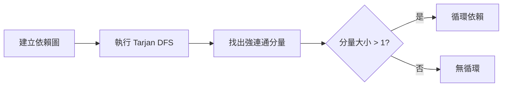
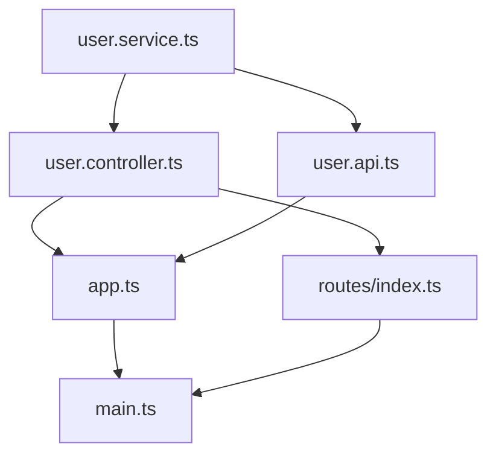

# Dependencies 功能詳細說明

> 程式碼依賴關係分析工具，視覺化依賴圖、檢測循環依賴

---

## 概述

Dependencies 功能提供完整的程式碼依賴關係分析，能快速找出專案中的循環依賴、孤立檔案、高耦合模組等問題。

### 核心特性

- **依賴圖生成**：完整的檔案依賴關係視覺化
- **循環依賴檢測**：使用 Tarjan 演算法檢測強連通分量
- **影響範圍分析**：使用 BFS 追蹤變更影響
- **孤立檔案識別**：找出沒有被引用的檔案
- **耦合度分析**：計算模組間的耦合程度

---

## 使用方式

### CLI 命令

```bash
# 基本依賴分析
agent-ide deps --path /path/to/project

# JSON 輸出（推薦）
agent-ide deps --path /path/to/project --format json

# 顯示完整依賴圖
agent-ide deps --path /path/to/project --format json --all

# 分析特定檔案
agent-ide deps --file src/service.ts --format json

# 只檢查循環依賴
agent-ide deps --check-cycles --format json
```

### MCP 工具

```typescript
// 基本依賴分析
const result = await mcp.executeTool('code_deps', {
  path: '/path/to/project'
});

// 分析特定檔案
const result = await mcp.executeTool('code_deps', {
  path: '/path/to/project',
  file: 'src/service.ts'
});

// 檢測循環依賴
const result = await mcp.executeTool('code_deps', {
  path: '/path/to/project',
  checkCycles: true
});
```

---

## 分析結果結構

### 標準輸出格式

預設模式下只顯示問題項目（節省 token）：

```json
{
  "summary": {
    "totalFiles": 234,
    "totalDependencies": 567,
    "circularDependencies": 3,
    "orphanFiles": 5,
    "maxDepth": 8,
    "avgDependenciesPerFile": 2.4
  },
  "issues": {
    "cycles": [
      {
        "files": ["src/a.ts", "src/b.ts", "src/c.ts"],
        "severity": "high",
        "description": "Circular dependency detected"
      }
    ],
    "orphans": [
      {
        "file": "src/unused.ts",
        "reason": "No imports from other files"
      }
    ]
  }
}
```

### 完整輸出格式（--all）

包含完整依賴圖：

```json
{
  "summary": { /* 同上 */ },
  "issues": { /* 同上 */ },
  "graph": {
    "nodes": [
      {
        "id": "src/a.ts",
        "imports": 3,
        "exports": 5,
        "dependents": 8
      }
    ],
    "edges": [
      {
        "from": "src/a.ts",
        "to": "src/b.ts",
        "symbols": ["getUserData", "UserService"]
      }
    ]
  }
}
```

---

## 循環依賴檢測

### Tarjan 演算法

使用 Tarjan 強連通分量演算法檢測循環依賴，時間複雜度 O(V+E)：



### 循環依賴範例

```bash
agent-ide deps --check-cycles --format json
```

**輸出**：
```json
{
  "summary": {
    "circularDependencies": 2
  },
  "issues": {
    "cycles": [
      {
        "files": [
          "src/services/user.service.ts",
          "src/services/auth.service.ts"
        ],
        "severity": "medium",
        "description": "UserService imports AuthService, AuthService imports UserService"
      },
      {
        "files": [
          "src/api/user.ts",
          "src/api/post.ts",
          "src/api/comment.ts"
        ],
        "severity": "high",
        "description": "Three-way circular dependency"
      }
    ]
  }
}
```

### 循環依賴嚴重性

| 嚴重程度 | 檔案數量 | 說明 | 建議 |
|---------|---------|------|------|
| **low** | 2 | 兩個檔案互相引用 | 考慮合併或抽取共用介面 |
| **medium** | 3-4 | 小型循環 | 重構，引入依賴注入 |
| **high** | 5+ | 大型循環 | 緊急重構，可能需要重新設計 |

---

## 影響範圍分析

### BFS 追蹤變更影響

使用廣度優先搜尋追蹤檔案變更的影響範圍：

```bash
# 分析特定檔案的影響範圍
agent-ide deps --file src/services/user.service.ts --format json
```

**輸出**：
```json
{
  "file": "src/services/user.service.ts",
  "directDependents": [
    "src/controllers/user.controller.ts",
    "src/api/user.ts"
  ],
  "indirectDependents": [
    "src/app.ts",
    "src/routes/index.ts"
  ],
  "impactRadius": {
    "depth1": 2,
    "depth2": 5,
    "depth3": 12,
    "total": 19
  },
  "riskLevel": "high"
}
```

### 影響範圍視覺化



**深度說明**：
- **Depth 1**：直接依賴（直接 import 此檔案）
- **Depth 2**：間接依賴（透過一個檔案間接依賴）
- **Depth 3+**：更深層的間接依賴

---

## 孤立檔案識別

### 檢測未使用的檔案

找出沒有被任何其他檔案引用的檔案：

```bash
agent-ide deps --format json
```

**輸出（issues.orphans）**：
```json
{
  "issues": {
    "orphans": [
      {
        "file": "src/utils/old-helper.ts",
        "reason": "No imports from other files",
        "lastModified": "2024-03-15",
        "suggestion": "Consider removing if unused"
      },
      {
        "file": "src/legacy/adapter.ts",
        "reason": "Only exports, no usages found",
        "suggestion": "May be part of public API"
      }
    ]
  }
}
```

### 孤立檔案分類

| 類型 | 說明 | 處理方式 |
|------|------|---------|
| **真孤立** | 完全沒被使用 | 可安全刪除 |
| **入口檔案** | index.ts、main.ts | 正常，保留 |
| **公開 API** | 只 export，外部使用 | 檢查是否為套件 API |
| **測試檔案** | *.test.ts | 正常，保留 |

---

## 耦合度分析

### 計算模組耦合

分析模組間的耦合程度：

```bash
agent-ide deps --format json --all
```

**耦合度指標**：
```json
{
  "coupling": {
    "src/services/": {
      "afferentCoupling": 15,    // 被多少模組依賴
      "efferentCoupling": 8,     // 依賴多少模組
      "instability": 0.35,       // 不穩定性 (Ce / (Ca + Ce))
      "abstractness": 0.2,       // 抽象程度
      "distance": 0.45           // 主序列距離
    }
  }
}
```

### 耦合度評級

| 指標 | 理想範圍 | 說明 |
|------|---------|------|
| **Instability** | 0.3-0.7 | 太低難擴展，太高易崩潰 |
| **Abstractness** | 0.2-0.8 | 抽象與具體的平衡 |
| **Distance** | <0.3 | 距離主序列的距離 |

---

## 實用範例

### 1. 重構前影響評估

```bash
# 評估修改 user.service.ts 的影響
agent-ide deps --file src/services/user.service.ts --format json

# 檢視結果
cat result.json | jq '.impactRadius.total'
# 輸出: 19

# 影響 19 個檔案，需謹慎重構
```

### 2. 找出需要重構的循環依賴

```bash
# 檢測所有循環依賴
agent-ide deps --check-cycles --format json > cycles.json

# 提取高嚴重性循環
cat cycles.json | jq '.issues.cycles[] | select(.severity == "high")'
```

### 3. 清理未使用的檔案

```bash
# 找出孤立檔案
agent-ide deps --format json | jq '.issues.orphans[].file'

# 輸出：
# "src/utils/old-helper.ts"
# "src/legacy/adapter.ts"

# 手動檢查後刪除
rm src/utils/old-helper.ts
```

### 4. 分析模組耦合度

```bash
# 分析整個專案
agent-ide deps --format json --all > deps.json

# 找出高耦合模組
cat deps.json | jq '.coupling | to_entries[] | select(.value.instability > 0.8)'

# 找出高度不穩定的模組需要重構
```

### 5. 視覺化依賴圖

```bash
# 生成依賴圖資料
agent-ide deps --format json --all > deps.json

# 使用 graphviz 視覺化
cat deps.json | jq -r '.graph.edges[] | "\(.from) -> \(.to)"' | \
  awk 'BEGIN{print "digraph{"} {print} END{print "}"}' | \
  dot -Tpng > deps.png
```

---

## 與其他工具比較

### vs Madge

| 特性 | agent-ide deps | Madge |
|------|----------------|-------|
| 循環依賴檢測 | ✅ Tarjan | ✅ DFS |
| 影響範圍分析 | ✅ | ❌ |
| 孤立檔案檢測 | ✅ | ❌ |
| 耦合度分析 | ✅ | ❌ |
| JSON 輸出 | ✅ | ✅ |
| 圖形視覺化 | ⚠️ 需外部工具 | ✅ 內建 |

### vs dependency-cruiser

| 特性 | agent-ide deps | dependency-cruiser |
|------|----------------|--------------------|
| 速度 | ⚡⚡⚡ | ⚡⚡ |
| TypeScript 支援 | ✅ | ✅ |
| 自訂規則 | ❌ | ✅ |
| CI/CD 整合 | ✅ | ✅ |
| 學習曲線 | 低 | 中 |

**建議**：
- 快速檢測循環依賴 → agent-ide deps
- 複雜規則驗證 → dependency-cruiser
- 視覺化需求 → Madge

---

## 疑難排解

### 找不到依賴關係

**問題**：部分 import 沒有被檢測到

**原因**：
- 使用動態 import
- 路徑別名未正確設定
- 非標準 import 語法

**解決方法**：
```bash
# 1. 檢查 tsconfig.json 路徑設定
cat tsconfig.json | jq '.compilerOptions.paths'

# 2. 強制重建索引
agent-ide index --force

# 3. 使用 search 驗證
agent-ide search "import.*from" --type regex
```

### 誤報循環依賴

**問題**：報告了不存在的循環依賴

**原因**：
- 型別引用被誤判為循環
- import type 未被正確處理

**解決方法**：
```bash
# 檢查是否為型別引用
agent-ide search "import type.*from" --type regex --file src/a.ts

# 如果只是型別引用，可以忽略或使用 import type
```

### 效能問題

**問題**：大型專案分析緩慢

**解決方法**：
```bash
# 1. 只分析特定目錄
agent-ide deps --path src/ --format json

# 2. 排除 node_modules
echo "node_modules/" >> .agent-ide-ignore

# 3. 使用快取
agent-ide index  # 先建立索引
agent-ide deps --use-index
```

---

## 最佳實踐

### 1. 定期檢測循環依賴

```bash
# ✅ 加入 CI/CD pipeline
# .github/workflows/deps-check.yml
- name: Check Circular Dependencies
  run: |
    npx agent-ide deps --check-cycles --format json > cycles.json
    if [ $(jq '.summary.circularDependencies' cycles.json) -gt 0 ]; then
      echo "Circular dependencies detected!"
      exit 1
    fi
```

### 2. 重構前先分析影響

```bash
# ✅ 修改檔案前先檢查影響範圍
agent-ide deps --file src/services/user.service.ts --format json

# 檢視影響檔案數量
# 如果太多，考慮分階段重構
```

### 3. 追蹤耦合度趨勢

```bash
# ✅ 定期記錄耦合度
agent-ide deps --format json --all > deps-$(date +%Y%m%d).json

# 比較趨勢
jq '.coupling["src/services/"].instability' deps-20250101.json
jq '.coupling["src/services/"].instability' deps-20250201.json
```

### 4. 清理孤立檔案

```bash
# ✅ 每月檢查孤立檔案
agent-ide deps --format json | jq '.issues.orphans[]'

# 手動確認後刪除
# 減少專案維護負擔
```

### 5. 視覺化複雜依賴

```bash
# ✅ 新人導覽時使用依賴圖
agent-ide deps --format json --all > deps.json

# 生成圖表幫助理解架構
```

---

## CI/CD 整合

### GitHub Actions

```yaml
name: Dependency Analysis

on: [push, pull_request]

jobs:
  analyze:
    runs-on: ubuntu-latest
    steps:
      - uses: actions/checkout@v2

      - name: Install agent-ide
        run: npm install -g agent-ide

      - name: Check Circular Dependencies
        run: |
          agent-ide deps --check-cycles --format json > cycles.json
          if [ $(jq '.summary.circularDependencies' cycles.json) -gt 0 ]; then
            echo "::error::Circular dependencies detected"
            jq '.issues.cycles' cycles.json
            exit 1
          fi

      - name: Analyze Coupling
        run: |
          agent-ide deps --format json --all > deps.json
          # 檢查是否有高耦合模組
          high_coupling=$(jq '[.coupling | to_entries[] | select(.value.instability > 0.8)] | length' deps.json)
          if [ $high_coupling -gt 0 ]; then
            echo "::warning::High coupling detected in $high_coupling modules"
          fi

      - name: Upload Report
        uses: actions/upload-artifact@v2
        with:
          name: dependency-report
          path: deps.json
```

### GitLab CI

```yaml
dependency-check:
  stage: test
  script:
    - npm install -g agent-ide
    - agent-ide deps --check-cycles --format json > cycles.json
    - |
      if [ $(jq '.summary.circularDependencies' cycles.json) -gt 0 ]; then
        echo "Circular dependencies found!"
        exit 1
      fi
  artifacts:
    paths:
      - cycles.json
    when: always
```

---

## 總結

Dependencies 功能提供：

✅ **循環依賴檢測**：
- Tarjan 演算法
- 嚴重性分級
- 快速定位問題

✅ **影響範圍分析**：
- BFS 追蹤
- 多層深度分析
- 風險評估

✅ **架構洞察**：
- 孤立檔案識別
- 耦合度計算
- 依賴圖視覺化

**建議使用場景**：
- 重構前評估影響
- CI/CD 品質門檻
- 架構健康度監控
- 技術債追蹤
