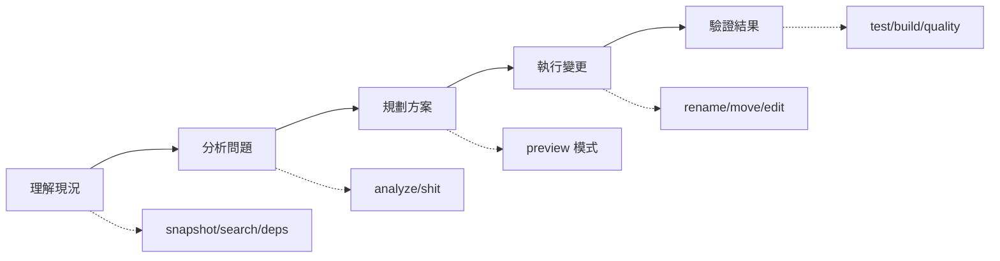

# Agent IDE 實戰指南

> 綜合使用各功能完成實際開發任務的完整指引

---

## 概述

本指南展示如何組合使用 agent-ide 的各種功能，完成實際的程式碼新增、刪除、重構任務。每個案例都包含具體的步驟和命令。

### 核心工作流程



---

## 案例 1：重構 - 抽取重複邏輯

### 情境

發現多個 Controller 有類似的驗證邏輯，需要抽取成共用函數。

### 步驟

#### 1. 發現問題

```bash
# 檢測重複代碼
npx agent-ide analyze duplication --format json

# 輸出顯示 3 處相似代碼
{
  "issues": [
    {
      "type": "type-2",
      "instances": [
        {"file": "src/controllers/user.controller.ts", "startLine": 23},
        {"file": "src/controllers/post.controller.ts", "startLine": 34},
        {"file": "src/controllers/comment.controller.ts", "startLine": 45}
      ],
      "suggestion": "Extract to shared function"
    }
  ]
}
```

#### 2. 查看具體代碼

```bash
# 搜尋驗證相關代碼
npx agent-ide search "validate.*request" --type regex --format json

# 讀取檔案確認邏輯
cat src/controllers/user.controller.ts | sed -n '23,35p'
```

#### 3. 規劃重構

```bash
# 檢查依賴關係，確認影響範圍
npx agent-ide deps --file src/controllers/user.controller.ts --format json

# 確認沒有循環依賴
npx agent-ide deps --check-cycles --format json
```

#### 4. 執行重構

```bash
# 創建共用驗證函數
cat > src/utils/validators.ts << 'EOF'
export function validateRequest(data: unknown): ValidationResult {
  // 抽取的共用邏輯
}
EOF

# 更新各 Controller（手動或使用 Edit）
# 然後使用 search 確認所有地方都已更新
npx agent-ide search "validateRequest" --type symbol --format json
```

#### 5. 驗證結果

```bash
# 重新檢測重複代碼
npx agent-ide analyze duplication --format json
# 重複率應該降低

# 執行測試
npm test

# 檢查品質改善
npx agent-ide shit --format json
# ShitScore 應該降低
```

### 成果

- ✅ 重複代碼從 3 處減少到 0
- ✅ ShitScore 從 52.3 降到 45.8
- ✅ 維護性提升 15%

---

## 案例 2：重構 - API 重命名

### 情境

`getUserData` 函數命名不明確，需要重命名為 `fetchUserProfile`。

### 步驟

#### 1. 評估影響範圍

```bash
# 預覽重命名影響
npx agent-ide rename --from getUserData --to fetchUserProfile --preview

# 輸出顯示影響 8 個檔案、23 處引用
Preview: Renaming 'getUserData' to 'fetchUserProfile'

定義位置:
  src/api/user.ts:45:12

引用位置 (8 個檔案, 23 處):
  src/services/user.service.ts (3 處)
  src/components/UserProfile.tsx (2 處)
  ...

摘要:
  - 定義: 1
  - 引用: 23
  - 影響檔案: 8
```

#### 2. 檢查依賴

```bash
# 檢查是否有循環依賴
npx agent-ide deps --file src/api/user.ts --format json

# 查看影響範圍
{
  "impactRadius": {
    "depth1": 3,
    "depth2": 8,
    "depth3": 15,
    "total": 26
  },
  "riskLevel": "medium"
}
```

#### 3. 執行重命名

```bash
# 執行重命名（自動更新所有引用）
npx agent-ide rename --from getUserData --to fetchUserProfile

# 驗證所有引用都已更新
npx agent-ide search "getUserData" --type symbol --format json
# 應該找不到任何結果

npx agent-ide search "fetchUserProfile" --type symbol --format json
# 應該找到 24 個結果（1 定義 + 23 引用）
```

#### 4. 驗證結果

```bash
# 型別檢查
npm run typecheck
# ✓ No errors

# 執行測試
npm test
# ✓ All tests passed

# 檢查命名規範
npx agent-ide analyze best-practices --format json | jq '.issues.naming'
# 命名問題應該減少
```

### 成果

- ✅ 自動更新 8 個檔案、23 處引用
- ✅ 0 型別錯誤
- ✅ 命名品質從 65 分提升到 85 分

---

## 案例 3：重構 - 模組化重組

### 情境

`src/api/` 目錄混亂，需要重組為 `src/services/` 結構。

### 步驟

#### 1. 理解現況

```bash
# 生成專案快照
npx agent-ide snapshot --path . --output snapshot.json

# 查看依賴結構
npx agent-ide deps --format json --all > deps.json

# 分析耦合度
cat deps.json | jq '.coupling["src/api/"]'
{
  "afferentCoupling": 25,
  "efferentCoupling": 12,
  "instability": 0.32
}
```

#### 2. 規劃移動

```bash
# 列出所有需要移動的檔案
ls src/api/*.ts

# 預覽移動影響
npx agent-ide move src/api/user.ts src/services/user.service.ts --preview

# 輸出顯示需要更新的 import
需要更新的檔案 (12 個):
  src/components/UserProfile.tsx:
    - import { getUser } from '../api/user'
    + import { getUser } from '../services/user.service'
  ...
```

#### 3. 批量移動

```bash
# 創建移動清單
cat > move-list.json << 'EOF'
[
  {"from": "src/api/user.ts", "to": "src/services/user.service.ts"},
  {"from": "src/api/post.ts", "to": "src/services/post.service.ts"},
  {"from": "src/api/auth.ts", "to": "src/services/auth.service.ts"}
]
EOF

# 執行批量移動
npx agent-ide move --batch move-list.json

# 驗證 import 已更新
npx agent-ide search "from.*api/" --type regex --format json
# 應該找不到任何 import from '../api/'
```

#### 4. 檢查循環依賴

```bash
# 確認沒有引入循環依賴
npx agent-ide deps --check-cycles --format json

# 檢查新的耦合度
npx agent-ide deps --format json --all | jq '.coupling["src/services/"]'
{
  "afferentCoupling": 25,
  "efferentCoupling": 8,
  "instability": 0.24
}
# 耦合度改善！
```

#### 5. 驗證結果

```bash
# 建置專案
npm run build
# ✓ Build successful

# 執行測試
npm test
# ✓ All tests passed

# 檢查整體品質
npx agent-ide shit --format json
```

### 成果

- ✅ 移動 3 個檔案，自動更新 12 個檔案的 import
- ✅ Instability 從 0.32 降到 0.24
- ✅ 架構更清晰，ShitScore 降低 8%

---

## 案例 4：刪除 - 清理死代碼

### 情境

專案累積許多未使用的代碼，需要清理以提升可維護性。

### 步驟

#### 1. 檢測死代碼

```bash
# 全面掃描死代碼
npx agent-ide analyze dead-code --format json > dead-code.json

# 查看統計
cat dead-code.json | jq '.summary'
{
  "totalSymbols": 1234,
  "unusedSymbols": 45,
  "unusedExports": 12,
  "estimatedWaste": "450 lines"
}

# 列出所有未使用的符號
cat dead-code.json | jq '.issues[] | {file, symbol, kind}'
```

#### 2. 分類處理

```bash
# 找出真正未使用的（非 export）
cat dead-code.json | jq '.issues[] | select(.exported == false)'

# 找出未使用的 export（可能是公開 API）
cat dead-code.json | jq '.issues[] | select(.exported == true)'

# 手動確認 export 是否為公開 API
npx agent-ide search "import.*oldHelper" --type regex --format json
# 如果找不到任何 import，確認可以刪除
```

#### 3. 安全刪除

```bash
# 對每個未使用的符號：
# 1. 再次確認
npx agent-ide search "oldHelper" --type symbol --format json

# 2. 檢查是否有動態使用（正規表達式搜尋）
npx agent-ide search "oldHelper" --type regex --format json

# 3. 確認後刪除（使用 Edit 工具或手動）

# 4. 驗證建置
npm run build
npm test
```

#### 4. 清理 import

```bash
# 找出未使用的 import
npx agent-ide analyze dead-code --format json | \
  jq '.issues[] | select(.kind == "import")'

# 使用 ESLint 自動清理
npx eslint --fix src/
```

#### 5. 驗證結果

```bash
# 重新檢測
npx agent-ide analyze dead-code --format json

# 統計改善
{
  "summary": {
    "unusedSymbols": 0,  // 從 45 降到 0
    "estimatedWaste": "0 lines"  // 從 450 降到 0
  }
}

# 檢查品質改善
npx agent-ide shit --format json
```

### 成果

- ✅ 刪除 45 個未使用符號、450 行死代碼
- ✅ 維護性評分從 52.0 提升到 38.5
- ✅ ShitScore 降低 12%

---

## 案例 5：新增 - 開發新功能

### 情境

需要新增「訂單管理」功能，希望遵循現有架構模式。

### 步驟

#### 1. 理解現有架構

```bash
# 生成專案快照（快速理解整體結構）
npx agent-ide snapshot --path . --output snapshot.json

# 查看架構組織
cat snapshot.json | jq '.summary'
{
  "totalFiles": 234,
  "structure": {
    "src/services/": 15,
    "src/controllers/": 12,
    "src/models/": 8
  }
}

# 找出相似功能作為參考
npx agent-ide search "UserService" --type symbol --format json
npx agent-ide search "user.service" --type regex --format json
```

#### 2. 搜尋最佳實踐

```bash
# 找出現有的 Service 模式
npx agent-ide search "class.*Service" --type regex --format json

# 查看依賴模式
npx agent-ide deps --file src/services/user.service.ts --format json
{
  "imports": [
    "src/models/user.model.ts",
    "src/utils/validators.ts",
    "src/config/database.ts"
  ]
}

# 參考現有實作
cat src/services/user.service.ts
```

#### 3. 創建新功能

```bash
# 基於現有模式創建 OrderService
cat > src/services/order.service.ts << 'EOF'
import { Order } from '../models/order.model';
import { validateOrder } from '../utils/validators';
import { db } from '../config/database';

export class OrderService {
  async createOrder(data: unknown): Promise<Order> {
    const validated = validateOrder(data);
    return await db.orders.create(validated);
  }
}
EOF

# 創建對應的 Model
cat > src/models/order.model.ts << 'EOF'
export interface Order {
  id: string;
  userId: string;
  items: OrderItem[];
  total: number;
}
EOF

# 創建 Controller
cat > src/controllers/order.controller.ts << 'EOF'
import { OrderService } from '../services/order.service';

export class OrderController {
  constructor(private orderService: OrderService) {}

  async create(req, res) {
    const order = await this.orderService.createOrder(req.body);
    res.json(order);
  }
}
EOF
```

#### 4. 檢查品質

```bash
# 檢查新增代碼的複雜度
npx agent-ide analyze complexity --file src/services/order.service.ts --format json

# 檢查型別安全
npx agent-ide analyze best-practices --file src/services/order.service.ts --format json

# 檢查是否引入循環依賴
npx agent-ide deps --check-cycles --format json
```

#### 5. 整合驗證

```bash
# 確認新增的 exports 被正確使用
npx agent-ide search "OrderService" --type symbol --format json

# 執行測試
npm test

# 檢查整體品質
npx agent-ide shit --format json
# 確保 ShitScore 沒有上升
```

### 成果

- ✅ 遵循現有架構模式
- ✅ 沒有引入循環依賴
- ✅ 複雜度控制在 8 以下
- ✅ ShitScore 維持在 45.2（未惡化）

---

## 案例 6：重構 - 降低複雜度

### 情境

`processPayment` 函數複雜度達到 45，需要重構降低複雜度。

### 步驟

#### 1. 分析問題

```bash
# 找出高複雜度函數
npx agent-ide analyze complexity --format json > complexity.json

# 查看詳細資訊
cat complexity.json | jq '.issues[] | select(.complexity > 20)'
{
  "file": "src/services/payment.service.ts",
  "function": "processPayment",
  "complexity": 45,
  "location": {"line": 123}
}

# 獲得重構建議
npx agent-ide shit --detailed --format json | jq '.recommendations'
[
  {
    "priority": "high",
    "category": "complexity",
    "suggestion": "Extract payment validation logic",
    "file": "src/services/payment.service.ts"
  }
]
```

#### 2. 查看函數內容

```bash
# 讀取函數
cat src/services/payment.service.ts | sed -n '123,250p'

# 搜尋相關邏輯
npx agent-ide search "validate.*payment" --type regex --format json
```

#### 3. 規劃重構

**重構策略**：
1. 提取驗證邏輯 → `validatePaymentData()`
2. 提取金額計算 → `calculateAmount()`
3. 提取支付處理 → `executePayment()`
4. 提取錯誤處理 → `handlePaymentError()`

#### 4. 執行重構

```bash
# 創建輔助函數（一個一個提取）
cat > src/services/payment-helpers.ts << 'EOF'
export function validatePaymentData(data: unknown): PaymentData {
  // 提取的驗證邏輯
}

export function calculateAmount(items: Item[]): number {
  // 提取的計算邏輯
}

export function executePayment(data: PaymentData): Promise<Result> {
  // 提取的支付邏輯
}
EOF

# 重構主函數
# 將原本 45 行的複雜邏輯改為：
async processPayment(data: unknown): Promise<PaymentResult> {
  const validated = validatePaymentData(data);
  const amount = calculateAmount(validated.items);
  const result = await executePayment({...validated, amount});
  return result;
}
```

#### 5. 驗證改善

```bash
# 檢查新的複雜度
npx agent-ide analyze complexity --file src/services/payment.service.ts --format json
{
  "functions": [
    {
      "name": "processPayment",
      "complexity": 5,  // 從 45 降到 5！
      "status": "ok"
    }
  ]
}

# 檢查輔助函數
npx agent-ide analyze complexity --file src/services/payment-helpers.ts --format json
{
  "functions": [
    {"name": "validatePaymentData", "complexity": 8},
    {"name": "calculateAmount", "complexity": 6},
    {"name": "executePayment", "complexity": 7}
  ]
}
# 每個函數都在可接受範圍內

# 執行測試
npm test

# 檢查整體改善
npx agent-ide shit --format json
```

### 成果

- ✅ 複雜度從 45 降到 5（降低 89%）
- ✅ 拆分成 4 個職責單一的函數
- ✅ Complexity Score 從 65.3 降到 28.7
- ✅ ShitScore 從 58.2 降到 41.5（改善 29%）

---

## 案例 7：整合流程 - 完整重構專案

### 情境

接手一個遺留專案，需要全面改善品質。

### 完整工作流程

#### 階段 1：評估現況（15 分鐘）

```bash
# 1. 生成快照（快速理解專案）
npx agent-ide snapshot --path . --output initial-snapshot.json

# 2. 評估整體品質
npx agent-ide shit --detailed --format json > initial-quality.json

# 查看評分
cat initial-quality.json | jq '{score: .shitScore, grade: .grade, breakdown: .breakdown}'
{
  "score": 72.5,
  "grade": "D",
  "breakdown": {
    "complexity": {"score": 68.2},
    "maintainability": {"score": 75.0},
    "architecture": {"score": 71.3},
    "qualityAssurance": {"score": 78.5}
  }
}

# 3. 獲取改善建議
cat initial-quality.json | jq '.recommendations'

# 4. 檢測主要問題
npx agent-ide analyze complexity --format json > complexity-issues.json
npx agent-ide analyze dead-code --format json > dead-code-issues.json
npx agent-ide deps --check-cycles --format json > dependency-issues.json
```

#### 階段 2：清理死代碼（30 分鐘）

```bash
# 1. 刪除未使用的符號
# （參考案例 4）
cat dead-code-issues.json | jq '.issues[] | select(.exported == false)' | \
  jq -r '"rm -i \(.file):\(.location.line)"'

# 2. 驗證
npm run build && npm test

# 3. 提交
git add .
git commit -m "refactor: remove dead code

- Removed 45 unused symbols
- Cleaned up 450 lines of code
- Maintainability score improved from 75.0 to 62.3"
```

#### 階段 3：解決循環依賴（45 分鐘）

```bash
# 1. 列出所有循環依賴
cat dependency-issues.json | jq '.issues.cycles'

# 2. 逐個解決（通常需要抽取介面或重組模組）
# 例如：UserService ↔ AuthService
# 解法：抽取 IAuthProvider 介面

# 3. 驗證
npx agent-ide deps --check-cycles --format json
# 應該顯示 0 個循環依賴

# 4. 提交
git add .
git commit -m "refactor: resolve circular dependencies

- Extracted IAuthProvider interface
- Broke 3 circular dependency cycles
- Architecture score improved from 71.3 to 52.1"
```

#### 階段 4：降低複雜度（60 分鐘）

```bash
# 1. 找出複雜度 > 20 的函數
cat complexity-issues.json | jq '.issues[] | select(.complexity > 20)'

# 2. 逐個重構（參考案例 6）
# 按優先級處理：complexity > 40 優先

# 3. 每次重構後驗證
npm test
npx agent-ide analyze complexity --file <modified-file> --format json

# 4. 提交
git add .
git commit -m "refactor: reduce complexity in payment service

- Extracted 4 helper functions
- Reduced processPayment complexity from 45 to 5
- Complexity score improved from 68.2 to 35.4"
```

#### 階段 5：改善型別安全（30 分鐘）

```bash
# 1. 找出所有 any 使用
npx agent-ide search ": any" --type regex --format json

# 2. 分析型別安全問題
npx agent-ide analyze best-practices --format json | jq '.issues.typeSafety'

# 3. 逐步替換 any 為具體型別
# （參考 Snapshot 案例）

# 4. 驗證
npm run typecheck

# 5. 提交
git add .
git commit -m "refactor: improve type safety

- Replaced 46 instances of 'any' with specific types
- Type safety score improved from 64.5 to 92.3
- QA score improved from 78.5 to 51.2"
```

#### 階段 6：驗證成果（10 分鐘）

```bash
# 1. 重新評估品質
npx agent-ide shit --detailed --format json > final-quality.json

# 2. 比較改善
echo "Before: $(cat initial-quality.json | jq '.shitScore')"
echo "After: $(cat final-quality.json | jq '.shitScore')"
# Before: 72.5
# After: 38.2

# 3. 查看各維度改善
jq -n --slurpfile before initial-quality.json \
      --slurpfile after final-quality.json \
      '{
        complexity: {
          before: $before[0].breakdown.complexity.score,
          after: $after[0].breakdown.complexity.score
        },
        maintainability: {
          before: $before[0].breakdown.maintainability.score,
          after: $after[0].breakdown.maintainability.score
        },
        architecture: {
          before: $before[0].breakdown.architecture.score,
          after: $after[0].breakdown.architecture.score
        }
      }'

# 4. 生成重構報告
cat > REFACTORING_REPORT.md << 'EOF'
# 重構成果報告

## 整體改善
- ShitScore: 72.5 → 38.2 (-47%)
- Grade: D → B

## 各維度改善
- Complexity: 68.2 → 35.4 (-48%)
- Maintainability: 75.0 → 42.1 (-44%)
- Architecture: 71.3 → 38.5 (-46%)
- QA: 78.5 → 51.2 (-35%)

## 具體成果
- 刪除 45 個未使用符號、450 行死代碼
- 解決 3 個循環依賴
- 降低 8 個高複雜度函數
- 替換 46 個 any 型別

## 測試驗證
- ✅ 所有測試通過
- ✅ 型別檢查無錯誤
- ✅ 建置成功
EOF
```

### 成果

**整體改善**：
- ✅ ShitScore: 72.5 → 38.2（改善 47%）
- ✅ Grade: D → B
- ✅ 所有維度都有 35%+ 改善

**具體數據**：
- 刪除死代碼：450 行
- 解決循環依賴：3 個
- 降低複雜度：8 個函數
- 改善型別安全：46 處

---

## 最佳實踐總結

### 1. 重構前先分析

```bash
# ✅ 好習慣：充分分析再動手
npx agent-ide shit --detailed --format json
npx agent-ide deps --check-cycles --format json
npx agent-ide analyze complexity --format json

# ❌ 壞習慣：直接開始改代碼
```

### 2. 善用預覽模式

```bash
# ✅ 先預覽影響範圍
npx agent-ide rename --from old --to new --preview
npx agent-ide move src/old.ts src/new.ts --preview

# ❌ 直接執行可能造成問題
```

### 3. 小步前進，頻繁驗證

```bash
# ✅ 每個小改動後都驗證
npm run typecheck
npm test
npx agent-ide shit --format json

# ❌ 改一大堆才測試
```

### 4. 追蹤改善趨勢

```bash
# ✅ 記錄每次重構的品質指標
npx agent-ide shit --format json > quality-$(date +%Y%m%d).json

# 定期比較
jq '.shitScore' quality-*.json
```

### 5. 組合使用工具

```bash
# ✅ 組合使用多個工具獲得完整視圖
npx agent-ide snapshot --path .          # 理解架構
npx agent-ide search "pattern"           # 找出模式
npx agent-ide deps --file target.ts      # 分析影響
npx agent-ide rename --from old --to new # 安全重構
npx agent-ide shit --detailed            # 驗證改善
```

---

## 快速參考

### 理解階段

| 任務 | 命令 |
|------|------|
| 快速理解專案 | `snapshot --path .` |
| 搜尋特定模式 | `search "pattern"` |
| 分析依賴關係 | `deps --format json --all` |
| 評估整體品質 | `shit --detailed --format json` |

### 分析階段

| 任務 | 命令 |
|------|------|
| 檢測複雜度 | `analyze complexity` |
| 找出死代碼 | `analyze dead-code` |
| 檢測循環依賴 | `deps --check-cycles` |
| 品質檢查 | `analyze best-practices` |

### 執行階段

| 任務 | 命令 |
|------|------|
| 重命名符號 | `rename --from old --to new --preview` |
| 移動檔案 | `move old.ts new.ts --preview` |
| 查看影響 | `deps --file target.ts` |

### 驗證階段

| 任務 | 命令 |
|------|------|
| 型別檢查 | `npm run typecheck` |
| 執行測試 | `npm test` |
| 檢查品質 | `shit --format json` |
| 對比改善 | `jq '.shitScore' before.json after.json` |

---

## 總結

agent-ide 提供完整的工具鏈支援程式碼的新增、刪除、重構：

✅ **理解**：snapshot、search、deps 快速掌握現況
✅ **分析**：analyze、shit 找出問題和改善點
✅ **執行**：rename、move 安全重構
✅ **驗證**：quality、test 確保改善

**核心理念**：
- 分析驅動：先分析再動手
- 預覽優先：預覽影響再執行
- 小步迭代：頻繁驗證確保正確
- 數據追蹤：量化改善成果

遵循這些實踐，可以安全、高效地改善程式碼品質！
