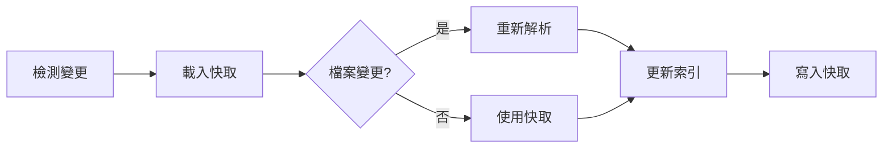

# Indexing 功能詳細說明

> 高效能程式碼索引引擎，為 agent-ide 所有功能提供基礎

---

## 概述

Indexing 是 agent-ide 的核心基礎設施，負責分析程式碼並建立高效的索引結構。所有上層功能（搜尋、重構、依賴分析等）都依賴於索引提供的資料。

### 核心特性

- **增量索引**：只重新索引變更的檔案
- **多層快取**：L1（記憶體）、L2（檔案）、L3（壓縮）
- **並行處理**：多執行緒解析大型專案
- **語言插件**：支援 TypeScript、JavaScript、Swift

### 效能指標

| 指標 | 數值 |
|------|------|
| 索引速度 | ~1000 檔案/秒 |
| 查詢延遲 | <50ms |
| 記憶體使用 | ~100MB / 10k 檔案 |
| 快取命中率 | >90% |

---

## 使用方式

### CLI 命令

```bash
# 基本索引建立
node dist/interfaces/cli/index.js index --path /path/to/project

# 增量更新（只索引變更檔案）
node dist/interfaces/cli/index.js index --path /path/to/project --incremental

# 強制完整重建
node dist/interfaces/cli/index.js index --path /path/to/project --force

# 查看索引狀態
node dist/interfaces/cli/index.js index --path /path/to/project --status
```

### MCP 工具

```typescript
// 建立索引
await mcp.executeTool('code_index', {
  action: 'create',
  path: '/path/to/project'
});

// 更新索引
await mcp.executeTool('code_index', {
  action: 'update',
  path: '/path/to/project'
});

// 查詢索引狀態
await mcp.executeTool('code_index', {
  action: 'status',
  path: '/path/to/project'
});
```

---

## 索引內容

### 符號索引

記錄所有程式碼符號的資訊：

```typescript
interface SymbolIndex {
  name: string;           // 符號名稱
  kind: SymbolKind;       // 類型（class/function/variable等）
  location: Location;     // 位置（檔案+行列）
  scope: string;          // 作用域
  modifiers: Modifier[];  // 修飾符（public/private/static等）
  references: Location[]; // 所有引用位置
  documentation?: string; // 文件註解
}
```

**支援的符號類型**：
- Class、Interface、Type
- Function、Method、Constructor
- Variable、Constant、Parameter
- Property、Enum、Module

### 依賴索引

記錄檔案間的依賴關係：

```typescript
interface DependencyIndex {
  file: string;              // 檔案路徑
  imports: ImportInfo[];     // 匯入項目
  exports: ExportInfo[];     // 匯出項目
  dependencies: string[];    // 依賴的檔案
  dependents: string[];      // 依賴此檔案的檔案
}
```

### 語法索引

記錄程式碼的語法結構：

```typescript
interface SyntaxIndex {
  file: string;
  ast: CompressedAST;        // 壓縮的抽象語法樹
  metrics: {
    complexity: number;      // 圈複雜度
    lines: number;           // 程式碼行數
    tokens: number;          // Token 數量
  };
}
```

---

## 工作流程

### 1. 初始索引建立


**步驟說明**：
1. **掃描檔案**：遞迴掃描專案目錄
2. **過濾檔案**：排除 node_modules、.git 等
3. **並行解析**：使用 Worker Pool 解析
4. **提取符號**：使用語言插件提取資訊
5. **建立索引**：組織成可查詢的結構
6. **寫入快取**：儲存到快取層

### 2. 增量更新



**優化策略**：
- 使用檔案 mtime 快速判斷變更
- 只重新索引變更的檔案
- 快取未變更檔案的索引
- 使用 diff 演算法更新依賴關係

---

## 快取機制

### L1 快取（記憶體）

**特點**：
- 最快存取速度（<1ms）
- 儲存最近使用的索引
- LRU 淘汰策略
- 預設大小：50MB

**適用場景**：
- 重複查詢相同符號
- IDE 自動完成
- 即時錯誤檢查

### L2 快取（檔案）

**特點**：
- 快速存取（<10ms）
- 持久化儲存
- 按檔案組織
- 支援增量更新

**儲存位置**：
```
.agent-ide/
├── index/
│   ├── symbols.json      # 符號索引
│   ├── dependencies.json # 依賴索引
│   └── syntax.json       # 語法索引
└── cache/
    └── files/
        └── [hash]/       # 按檔案 hash 快取
```

### L3 快取（壓縮）

**特點**：
- 最小儲存空間
- 延遲解壓（按需）
- 適合大型專案
- 壓縮率：~70%

**壓縮策略**：
- AST 節點去重
- 字串共用池
- Delta 編碼
- Gzip 壓縮

---

## 效能優化

### 並行處理

```typescript
// Worker Pool 設定
const workerPool = new WorkerPool({
  maxWorkers: os.cpus().length,
  taskTimeout: 30000,
  taskQueue: new PriorityQueue()
});

// 優先處理關鍵檔案
workerPool.submit(
  { file: 'index.ts', priority: 10 },
  { file: 'utils.ts', priority: 5 }
);
```

**優先級策略**：
1. Entry points（index.ts、main.ts）
2. 依賴數量多的檔案
3. 最近修改的檔案
4. 其他檔案

### 增量索引

**判斷檔案是否變更**：
```typescript
function needsReindex(file: string): boolean {
  const cached = cache.get(file);
  if (!cached) return true;

  const currentMtime = fs.statSync(file).mtime;
  const cachedMtime = cached.mtime;

  return currentMtime > cachedMtime;
}
```

**只更新影響範圍**：
```typescript
function updateIndex(changedFile: string) {
  // 1. 重新索引變更檔案
  const newIndex = parseFile(changedFile);

  // 2. 更新依賴此檔案的索引
  const dependents = getDependents(changedFile);
  for (const dep of dependents) {
    updateReferences(dep, newIndex);
  }

  // 3. 更新符號表
  symbolTable.merge(newIndex.symbols);
}
```

---

## 使用建議

### 何時建立索引

✅ **建議場景**：
- 專案初始化時
- 切換分支後
- 大量檔案變更後
- 重構前

❌ **無需手動索引**：
- 使用 search 命令（自動索引）
- 使用 MCP 工具（自動索引）
- 單一檔案修改

### 索引維護

**定期清理快取**：
```bash
# 清理過期快取（>30天未使用）
node dist/interfaces/cli/index.js index --clean --days 30

# 清理所有快取（重建索引）
node dist/interfaces/cli/index.js index --clean --all
```

**檢查索引健康度**：
```bash
# 顯示索引統計
node dist/interfaces/cli/index.js index --status --detailed

# 輸出範例：
# Files indexed: 1234
# Symbols: 5678
# Dependencies: 3456
# Cache size: 45MB
# Cache hit rate: 92%
# Last updated: 2025-10-31 10:30:00
```

---

## 疑難排解

### 索引速度慢

**原因**：
- 專案檔案過多
- 快取失效
- 磁碟 I/O 瓶頸

**解決方法**：
```bash
# 1. 排除不必要的目錄
echo "node_modules/\ndist/\n.git/" > .agent-ide-ignore

# 2. 增加 Worker 數量
WORKER_COUNT=8 node dist/interfaces/cli/index.js index

# 3. 使用 SSD 存放快取
export AGENT_IDE_CACHE=/path/to/ssd/.agent-ide
```

### 記憶體不足

**原因**：
- 專案過大（>10k 檔案）
- L1 快取設定過大
- 並行 Worker 過多

**解決方法**：
```bash
# 1. 減少快取大小
export AGENT_IDE_CACHE_SIZE=20MB

# 2. 減少 Worker 數量
export WORKER_COUNT=2

# 3. 使用流式索引（不載入所有檔案）
node dist/interfaces/cli/index.js index --stream
```

### 索引不準確

**原因**：
- 快取過期
- 解析錯誤
- 語言插件問題

**解決方法**：
```bash
# 1. 強制重建索引
node dist/interfaces/cli/index.js index --force

# 2. 清除快取後重建
rm -rf .agent-ide/cache
node dist/interfaces/cli/index.js index

# 3. 檢查語言插件
node dist/interfaces/cli/index.js parser-plugins --list
```

---

## 進階功能

### 自訂排除規則

**`.agent-ide-ignore` 檔案**：
```gitignore
# 排除測試檔案
**/*.test.ts
**/*.spec.ts

# 排除建置產物
dist/
build/
out/

# 排除第三方程式碼
node_modules/
vendor/

# 排除大型資料檔案
*.json
*.csv
```

### 語言插件設定

**`.agent-ide.json` 配置**：
```json
{
  "indexing": {
    "parallel": true,
    "maxWorkers": 4,
    "cacheSize": "50MB",
    "exclude": ["**/*.test.ts"]
  },
  "parsers": {
    "typescript": {
      "strictMode": true,
      "includeDeclarations": true
    },
    "javascript": {
      "jsx": true,
      "flow": false
    }
  }
}
```

### 監控索引效能

```bash
# 啟用效能追蹤
DEBUG=agent-ide:indexing node dist/interfaces/cli/index.js index

# 輸出範例：
# [indexing] Scanning files: 234ms
# [indexing] Parsing files: 1523ms
# [indexing] Building index: 456ms
# [indexing] Writing cache: 123ms
# [indexing] Total: 2336ms
```

---

## 最佳實踐

### 1. 持續維護索引

```bash
# 使用 Git hooks 自動更新索引
# .git/hooks/post-checkout
#!/bin/bash
node dist/interfaces/cli/index.js index --incremental
```

### 2. CI/CD 整合

```yaml
# .github/workflows/code-quality.yml
- name: Build Index
  run: |
    npm install -g agent-ide
    agent-ide index --path . --force

- name: Check Index Health
  run: |
    agent-ide index --status --format json > index-status.json
```

### 3. 多專案管理

```bash
# 建立工作區索引
agent-ide index --path ./project-a --workspace
agent-ide index --path ./project-b --workspace
agent-ide index --path ./project-c --workspace

# 查詢跨專案符號
agent-ide search "UserService" --workspace
```

---

## 總結

Indexing 是 agent-ide 的核心基礎，提供：

✅ **高效能**：
- 1000 檔案/秒的索引速度
- <50ms 的查詢延遲
- 三層快取機制

✅ **智能化**：
- 增量更新
- 自動快取管理
- 並行處理

✅ **可靠性**：
- 快取驗證
- 錯誤恢復
- 健康度監控

**建議**：
- 專案初始化時建立完整索引
- 日常開發依賴自動增量更新
- 定期清理快取維護效能
- 使用 Git hooks 保持索引同步
