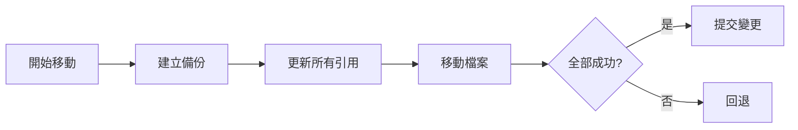

# Move 功能詳細說明

> 智能檔案移動工具，自動更新所有 import 路徑

---

## 概述

Move 功能提供安全的檔案移動能力，自動追蹤並更新所有依賴此檔案的 import 語句。避免移動檔案後需要手動修改大量引用的問題。

### 核心特性

- **自動更新 import**：自動修正所有引用路徑
- **依賴追蹤**：找出所有依賴檔案
- **預覽模式**：移動前查看影響範圍
- **批量移動**：一次移動多個檔案
- **原子操作**：全部成功或全部回退

---

## 使用方式

### CLI 命令

```bash
# 基本移動
agent-ide move src/old.ts src/new.ts

# 預覽影響範圍
agent-ide move src/old.ts src/new.ts --preview

# 移動目錄
agent-ide move src/api src/services/api

# 批量移動
agent-ide move --batch move-list.json

# 自動備份
agent-ide move src/old.ts src/new.ts --backup
```

---

## 移動流程

### 1. 依賴分析


### 2. 路徑計算


### 3. 更新引用


### 4. 執行移動



---

## 自動更新 Import

### 相對路徑更新

```typescript
// 移動前
// src/api/user.ts
export function getUser() { }

// src/components/UserProfile.tsx
import { getUser } from '../api/user';

// 執行移動
agent-ide move src/api/user.ts src/services/user.service.ts

// 移動後自動更新
// src/components/UserProfile.tsx
import { getUser } from '../services/user.service';
```

### 絕對路徑更新

```typescript
// 移動前
import { getUser } from '@/api/user';

// 執行移動
agent-ide move src/api/user.ts src/services/user.service.ts

// 移動後自動更新
import { getUser } from '@/services/user.service';
```

### 多種 import 樣式

支援所有 import 語法：

```typescript
// Default import
import User from './user';

// Named import
import { User, getUser } from './user';

// Namespace import
import * as UserAPI from './user';

// Side-effect import
import './user';

// Dynamic import
const User = await import('./user');

// Require (CommonJS)
const { User } = require('./user');
```

---

## 預覽模式

### 查看影響範圍

```bash
agent-ide move src/api/user.ts src/services/user.service.ts --preview
```

**輸出範例**：
```
Preview: Moving 'src/api/user.ts' to 'src/services/user.service.ts'

檔案移動:
  src/api/user.ts → src/services/user.service.ts

需要更新的檔案 (5 個):

src/components/UserProfile.tsx:
  Line 3:
    - import { getUser } from '../api/user'
    + import { getUser } from '../services/user.service'

src/pages/UserList.tsx:
  Line 5:
    - import { getUser } from '@/api/user'
    + import { getUser } from '@/services/user.service'

src/services/auth.service.ts:
  Line 8:
    - import type { User } from '../api/user'
    + import type { User } from './user.service'

... (更多檔案)

摘要:
  - 移動檔案: 1
  - 影響檔案: 5
  - 更新 import: 8
  - 更新 export: 2
```

---

## 批量移動

### 使用 JSON 檔案

```json
// move-list.json
[
  {
    "from": "src/api/user.ts",
    "to": "src/services/user.service.ts"
  },
  {
    "from": "src/api/post.ts",
    "to": "src/services/post.service.ts"
  }
]
```

```bash
agent-ide move --batch move-list.json --preview
```

### 目錄批量移動

```bash
# 移動整個目錄
agent-ide move src/api src/services/api

# 自動處理：
# - 目錄下所有檔案
# - 更新所有外部引用
# - 更新目錄內部的相對引用
```

---

## 特殊場景處理

### 1. Index 檔案移動

```bash
# 移動 index.ts
agent-ide move src/api/index.ts src/api/public-api.ts

# 自動更新：
# - import { User } from './api'
# + import { User } from './api/public-api'
```

### 2. 重新匯出處理

```typescript
// src/api/index.ts
export * from './user';
export { default as Post } from './post';

// 移動 user.ts 後自動更新
export * from './services/user';
```

### 3. 型別引用更新

```typescript
// 移動前
import type { User } from '../api/user';

// 移動後自動更新
import type { User } from '../services/user.service';
```

### 4. 動態 import 更新

```typescript
// 移動前
const UserModule = await import('./api/user');

// 移動後自動更新
const UserModule = await import('./services/user.service');
```

---

## 進階選項

### 保留原檔案

```bash
# 複製而非移動
agent-ide move src/old.ts src/new.ts --copy

# 結果：
# - 建立 new.ts
# - 保留 old.ts
# - 更新引用指向 new.ts
```

### 選擇性更新

```bash
# 只更新特定目錄的引用
agent-ide move src/api/user.ts src/services/user.ts \
  --update-only src/components

# 排除特定檔案
agent-ide move src/api/user.ts src/services/user.ts \
  --exclude "**/*.test.ts"
```

### 路徑別名處理

```bash
# 設定路徑別名（從 tsconfig.json 讀取）
agent-ide move src/api/user.ts src/services/user.ts \
  --use-aliases

# 手動指定別名
agent-ide move src/api/user.ts src/services/user.ts \
  --alias "@=src" --alias "~=src"
```

---

## 實用範例

### 1. 重組專案結構

```bash
# 原始結構
src/
  api/
    user.ts
    post.ts
  components/
    UserProfile.tsx

# 移動到新結構
agent-ide move src/api/user.ts src/services/user.service.ts --preview
agent-ide move src/api/post.ts src/services/post.service.ts --preview

# 確認後執行
agent-ide move --batch move-list.json
```

### 2. 抽取共用邏輯

```bash
# 將 utils 從檔案中抽取出來
# 1. 建立新檔案（手動或使用 refactor）
agent-ide refactor extract --file src/api/user.ts --output src/utils/user.utils.ts

# 2. 更新引用
# (Move 功能自動處理)
```

### 3. 模組化重構

```bash
# 將單一大檔案拆分為多個小檔案
# 1. 先拆分（手動）
# 2. 移動到模組目錄
agent-ide move src/user.ts src/user/index.ts
agent-ide move src/user.types.ts src/user/types.ts
agent-ide move src/user.utils.ts src/user/utils.ts

# 3. 自動更新所有引用
```

---

## Git 整合

### 自動 Git 操作

```bash
# 使用 git mv 而非 fs move
agent-ide move src/old.ts src/new.ts --git

# 等同於：
# git mv src/old.ts src/new.ts
# (並更新所有 import)

# 自動 commit
agent-ide move src/old.ts src/new.ts --git --commit

# Commit 訊息：
# refactor: move user.ts to user.service.ts
#
# - Updated 5 files
# - Modified 8 imports
```

### 檢視變更

```bash
# 移動後檢視 git diff
agent-ide move src/old.ts src/new.ts --git

git diff --cached
# 顯示：
# - 檔案移動
# - Import 路徑變更
```

---

## 與其他工具比較

### vs 手動移動

| 項目 | 手動 | agent-ide |
|------|------|-----------|
| 移動檔案 | 簡單 | 簡單 |
| 更新 import | 困難（易遺漏） | 自動 |
| 相對路徑計算 | 易錯 | 自動 |
| 檔案數量限制 | 小量 | 無限制 |
| 回退能力 | 困難 | 簡單 |

### vs IDE 重構

| 特性 | agent-ide | VS Code | IntelliJ |
|------|-----------|---------|----------|
| 自動更新 import | ✅ | ✅ | ✅ |
| 批量移動 | ✅ | ⚠️ | ✅ |
| CLI 支援 | ✅ | ❌ | ⚠️ |
| 預覽模式 | ✅ | ✅ | ✅ |
| Git 整合 | ✅ | ⚠️ | ✅ |

---

## 疑難排解

### Import 路徑未更新

**問題**：移動後某些 import 未更新

**原因**：
- 使用動態路徑
- 使用非標準 import
- 檔案未被索引

**解決方法**：
```bash
# 1. 重建索引
agent-ide index --force

# 2. 手動指定需更新的檔案
agent-ide move src/old.ts src/new.ts --update src/specific.ts

# 3. 檢查 import 語法
agent-ide search "old.ts" --type regex
```

### 路徑計算錯誤

**問題**：生成的相對路徑不正確

**解決方法**：
```bash
# 1. 使用絕對路徑移動
agent-ide move $(pwd)/src/old.ts $(pwd)/src/new.ts

# 2. 檢查 tsconfig.json 的 baseUrl 設定
cat tsconfig.json | jq '.compilerOptions.baseUrl'

# 3. 手動指定 baseUrl
agent-ide move src/old.ts src/new.ts --base-url ./src
```

### 循環依賴問題

**問題**：移動後出現循環依賴

**解決方法**：
```bash
# 1. 移動前檢查依賴
agent-ide deps --file src/old.ts

# 2. 使用預覽模式
agent-ide move src/old.ts src/new.ts --preview

# 3. 移動後檢查循環依賴
agent-ide deps --check-cycles
```

---

## 最佳實踐

### 1. 移動前先預覽

```bash
# ✅ 先預覽
agent-ide move src/old.ts src/new.ts --preview

# 確認無誤後執行
agent-ide move src/old.ts src/new.ts

# ❌ 直接執行
agent-ide move src/old.ts src/new.ts
```

### 2. 大型移動分批執行

```bash
# ✅ 分批移動
agent-ide move src/api/user.ts src/services/user.ts
# 測試
agent-ide move src/api/post.ts src/services/post.ts
# 測試

# ❌ 一次移動所有檔案
agent-ide move --batch all-files.json
```

### 3. 搭配版本控制

```bash
# ✅ 移動前 commit
git add .
git commit -m "Before move"

# 執行移動
agent-ide move src/old.ts src/new.ts --git

# 檢查變更
git diff

# ✅ 移動後 commit
git add .
git commit -m "refactor: move user files to services"
```

### 4. 移動後驗證

```bash
# ✅ 移動後執行測試
agent-ide move src/old.ts src/new.ts

npm test
npm run typecheck
npm run build
```

---

## 總結

Move 功能提供：

✅ **智能**：
- 自動更新所有 import
- 支援各種 import 語法
- 智能路徑計算
- 型別引用處理

✅ **安全**：
- 預覽模式
- 備份機制
- 原子操作
- 回退能力

✅ **高效**：
- 批量移動
- Git 整合
- CLI 自動化
- 並行處理

**建議使用時機**：
- 專案結構重組
- 模組化重構
- 抽取共用程式碼
- 遷移 API 檔案
