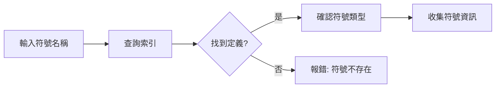
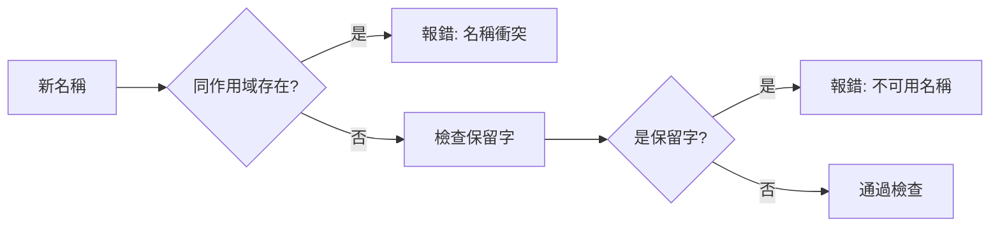
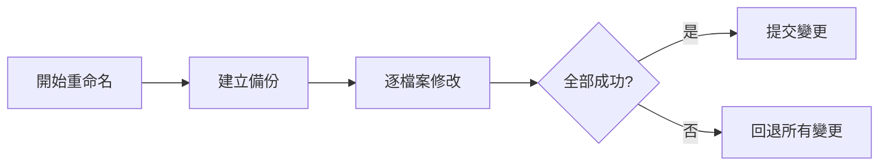

# Rename 功能詳細說明

> 安全的符號重命名工具，自動更新所有引用

---

## 概述

Rename 功能提供跨檔案的符號重命名能力，自動追蹤並更新所有引用位置。相比手動逐一修改，可避免遺漏和錯誤。

### 核心特性

- **全域追蹤**：找出所有引用位置
- **類型安全**：保持 TypeScript 型別正確
- **預覽模式**：重命名前查看影響範圍
- **原子操作**：全部成功或全部回退
- **備份機制**：支援操作前自動備份

---

## 使用方式

### CLI 命令

```bash
# 基本重命名
agent-ide rename --from oldName --to newName

# 預覽影響範圍（不實際修改）
agent-ide rename --from oldName --to newName --preview

# 指定專案路徑
agent-ide rename --from oldName --to newName --path /path/to/project

# 自動備份
agent-ide rename --from oldName --to newName --backup

# JSON 輸出
agent-ide rename --from oldName --to newName --format json
```

### MCP 工具

```typescript
// 預覽重命名
const preview = await mcp.executeTool('code_rename', {
  oldName: 'getUserData',
  newName: 'fetchUserInfo',
  preview: true
});

// 執行重命名
const result = await mcp.executeTool('code_rename', {
  oldName: 'getUserData',
  newName: 'fetchUserInfo',
  backup: true
});
```

---

## 重命名流程

### 1. 符號定義查找



### 2. 引用位置追蹤


### 3. 衝突檢查



### 4. 執行重命名



---

## 支援的符號類型

| 符號類型 | 支援 | 說明 |
|---------|------|------|
| 變數 | ✅ | `const`, `let`, `var` |
| 函數 | ✅ | `function`, 箭頭函數 |
| 類別 | ✅ | `class` |
| 介面 | ✅ | `interface` |
| 型別別名 | ✅ | `type` |
| 列舉 | ✅ | `enum` |
| 方法 | ✅ | 類別方法 |
| 屬性 | ✅ | 類別屬性 |
| 參數 | ✅ | 函數參數 |
| 模組 | ⚠️ | 需同時更新檔案名 |

---

## 預覽模式

### 查看影響範圍

```bash
agent-ide rename --from oldName --to newName --preview
```

**輸出範例**：
```
Preview: Renaming 'getUserData' to 'fetchUserInfo'

定義位置:
  src/api/user.ts:45:12
    export function getUserData(id: string) {

引用位置 (8 個檔案, 23 處):

src/api/user.ts:
  - Line 45: function definition
  - Line 67: JSDoc reference

src/services/user.service.ts:
  - Line 12: import { getUserData } from '../api/user'
  - Line 34: const data = await getUserData(userId)
  - Line 89: return getUserData(id).then(...)

src/components/UserProfile.tsx:
  - Line 8: import { getUserData } from '@/api/user'
  - Line 23: useEffect(() => { getUserData(id) }, [id])

... (更多檔案)

摘要:
  - 定義: 1
  - 引用: 23
  - 影響檔案: 8
  - 估計修改行數: 23
```

### JSON 格式預覽

```bash
agent-ide rename --from oldName --to newName --preview --format json
```

```json
{
  "oldName": "getUserData",
  "newName": "fetchUserInfo",
  "definition": {
    "file": "src/api/user.ts",
    "location": { "line": 45, "column": 12 },
    "kind": "function",
    "scope": "exported"
  },
  "references": [
    {
      "file": "src/api/user.ts",
      "location": { "line": 67, "column": 8 },
      "type": "jsdoc"
    },
    {
      "file": "src/services/user.service.ts",
      "location": { "line": 12, "column": 10 },
      "type": "import"
    }
  ],
  "summary": {
    "definitionCount": 1,
    "referenceCount": 23,
    "fileCount": 8,
    "estimatedChanges": 23
  },
  "conflicts": [],
  "warnings": []
}
```

---

## 衝突檢測

### 名稱衝突

```typescript
// 原始程式碼
function getData() { }
const newName = 123;

// 執行: agent-ide rename --from getData --to newName
// ❌ 錯誤: 'newName' already exists in this scope
```

### 保留字衝突

```bash
# 嘗試重命名為保留字
agent-ide rename --from myFunc --to interface
# ❌ 錯誤: 'interface' is a reserved keyword
```

### 作用域衝突

```typescript
// 外層作用域有同名變數
const userName = 'global';

function updateUser() {
  const userId = 123;
  // 重命名 userId -> userName
  // ⚠️ 警告: Will shadow outer scope variable 'userName'
}
```

---

## 特殊場景處理

### 1. 跨檔案重命名

```bash
# 重命名在多個檔案中使用的符號
agent-ide rename --from UserService --to UserRepository

# 自動更新：
# - 定義檔案
# - 所有 import 語句
# - 所有使用位置
# - JSDoc 註解
# - 型別引用
```

### 2. 類別成員重命名

```bash
# 重命名類別屬性
agent-ide rename --from user.name --to user.fullName

# 同時更新：
# - 屬性宣告
# - 建構函數初始化
# - 所有存取位置
# - Getter/Setter
```

### 3. 介面屬性重命名

```bash
# 重命名介面屬性
agent-ide rename --from IUser.email --to IUser.emailAddress

# 自動更新：
# - 介面定義
# - 實作該介面的類別
# - 型別斷言
# - 物件字面值
```

### 4. 方法重命名

```bash
# 重命名類別方法
agent-ide rename --from MyClass.getData --to MyClass.fetchData

# 同時更新：
# - 方法定義
# - 方法呼叫
# - 覆寫方法（子類別）
# - 介面宣告（如有）
```

---

## 進階選項

### 作用域限制

```bash
# 只重命名特定檔案中的符號
agent-ide rename --from temp --to temperature --file src/utils/math.ts

# 只重命名特定作用域
agent-ide rename --from config --to settings --scope global

# 排除特定檔案
agent-ide rename --from User --to Account --exclude "**/*.test.ts"
```

### 大小寫敏感

```bash
# 大小寫敏感（預設）
agent-ide rename --from getData --to GetData

# 大小寫不敏感
agent-ide rename --from getData --to GetData --ignore-case
```

### 批量重命名

```bash
# 使用 JSON 檔案批量重命名
cat rename-list.json
[
  { "from": "oldName1", "to": "newName1" },
  { "from": "oldName2", "to": "newName2" }
]

agent-ide rename --batch rename-list.json
```

---

## 備份與回退

### 自動備份

```bash
# 啟用備份（重命名前自動備份）
agent-ide rename --from oldName --to newName --backup

# 備份位置: .agent-ide/backups/rename_TIMESTAMP/
```

### 手動回退

```bash
# 列出所有備份
agent-ide backup list

# 輸出：
# 2025-10-31 10:30:00 rename_getUserData_to_fetchUserInfo
# 2025-10-31 09:15:00 rename_UserService_to_UserRepository

# 回退到指定備份
agent-ide backup restore rename_getUserData_to_fetchUserInfo
```

### Git 整合

```bash
# 重命名後自動 commit
agent-ide rename --from oldName --to newName --git-commit

# Commit 訊息：
# refactor: rename 'oldName' to 'newName'
#
# - Updated 8 files
# - Modified 23 references
```

---

## 實用範例

### 1. 函數重命名

```bash
# 原始程式碼
export function getUserData(id: string) {
  return fetch(`/api/users/${id}`);
}

# 執行重命名
agent-ide rename --from getUserData --to fetchUserInfo --preview

# 預覽結果
src/api/user.ts:45
  - export function getUserData(id: string) {
  + export function fetchUserInfo(id: string) {

src/services/user.service.ts:12
  - import { getUserData } from '../api/user'
  + import { fetchUserInfo } from '../api/user'

src/services/user.service.ts:34
  - const data = await getUserData(userId)
  + const data = await fetchUserInfo(userId)

# 確認無誤後執行
agent-ide rename --from getUserData --to fetchUserInfo
```

### 2. 類別重命名

```bash
# 原始程式碼
export class UserService {
  // ...
}

# 執行重命名
agent-ide rename --from UserService --to UserRepository --backup

# 自動更新：
# 1. 類別定義
# 2. 建構函數呼叫
# 3. Import 語句
# 4. 型別註解
# 5. JSDoc 註解
```

### 3. 介面屬性重命名

```bash
# 原始程式碼
interface IUser {
  email: string;
}

# 執行重命名
agent-ide rename --from IUser.email --to IUser.emailAddress

# 自動更新所有使用此介面的地方
```

---

## 與其他工具比較

### vs IDE 重構功能

| 特性 | agent-ide | VS Code | IntelliJ |
|------|-----------|---------|----------|
| 跨檔案重命名 | ✅ | ✅ | ✅ |
| 預覽模式 | ✅ | ✅ | ✅ |
| CLI 支援 | ✅ | ❌ | ⚠️ |
| 批量重命名 | ✅ | ❌ | ⚠️ |
| 備份機制 | ✅ | ❌ | ⚠️ |
| CI/CD 整合 | ✅ | ❌ | ❌ |

### vs 手動重命名

| 項目 | 手動 | agent-ide |
|------|------|-----------|
| 速度 | 慢（逐一修改） | 快（自動更新） |
| 準確性 | 易遺漏 | 100% 覆蓋 |
| 安全性 | 高風險 | 低風險（有備份） |
| 可回退 | 困難 | 簡單 |

---

## 疑難排解

### 找不到符號

**問題**：`Error: Symbol 'oldName' not found`

**解決方法**：
```bash
# 1. 確認符號名稱正確
agent-ide search "oldName" --type symbol

# 2. 重建索引
agent-ide index --force

# 3. 使用完整路徑
agent-ide rename --from oldName --to newName --file src/api/user.ts
```

### 名稱衝突

**問題**：`Error: 'newName' already exists`

**解決方法**：
```bash
# 1. 先重命名衝突的符號
agent-ide rename --from existingNewName --to tempName

# 2. 執行原本的重命名
agent-ide rename --from oldName --to newName

# 3. 如需，重命名 tempName
agent-ide rename --from tempName --to anotherName
```

### 部分檔案無法更新

**問題**：某些檔案沒有被更新

**原因**：
- 檔案被 .gitignore
- 檔案權限問題
- 檔案正在被編輯

**解決方法**：
```bash
# 1. 檢查 .agent-ide-ignore
cat .agent-ide-ignore

# 2. 檢查檔案權限
ls -la problematic-file.ts

# 3. 強制重新掃描
agent-ide rename --from oldName --to newName --force
```

---

## 最佳實踐

### 1. 重命名前先預覽

```bash
# ✅ 先預覽
agent-ide rename --from oldName --to newName --preview

# 確認無誤後執行
agent-ide rename --from oldName --to newName

# ❌ 直接執行（風險高）
agent-ide rename --from oldName --to newName
```

### 2. 重要重命名啟用備份

```bash
# ✅ 啟用備份
agent-ide rename --from oldName --to newName --backup

# ❌ 無備份（無法回退）
agent-ide rename --from oldName --to newName
```

### 3. 大型重命名分階段執行

```bash
# ✅ 先重命名一個模組測試
agent-ide rename --from oldName --to newName --path src/api

# 確認無問題後擴大範圍
agent-ide rename --from oldName --to newName --path src

# ❌ 一次重命名整個專案（風險高）
agent-ide rename --from oldName --to newName
```

### 4. 搭配版本控制

```bash
# ✅ 重命名前先 commit
git add .
git commit -m "Before rename"

# 執行重命名
agent-ide rename --from oldName --to newName

# 檢查變更
git diff

# ✅ 重命名後再 commit
git add .
git commit -m "refactor: rename oldName to newName"
```

---

## 總結

Rename 功能提供：

✅ **安全**：
- 全域追蹤所有引用
- 衝突檢測
- 備份機制
- 原子操作

✅ **高效**：
- 自動更新所有檔案
- 預覽模式
- 批量處理
- CLI 自動化

✅ **可靠**：
- TypeScript 類型感知
- 作用域分析
- 回退機制
- Git 整合

**建議使用時機**：
- 重構 API 命名
- 統一命名風格
- 修正拼寫錯誤
- 模組重組
