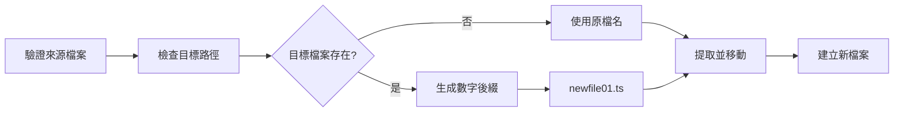

# Shift 功能詳細說明

> 行級程式碼移動工具，支援單檔案內、跨檔案及新檔案生成

---

## 概述

Shift 功能提供精確的行級程式碼移動能力，可以將指定範圍的程式碼行移動到同一檔案的不同位置、移動到其他已存在的檔案，或移動到新建立的檔案。

### 核心特性

- **單檔案內移動**：在同一檔案內重新排列程式碼行
- **跨檔案移動**：將程式碼行移動到其他已存在的檔案
- **新檔案生成**：移動到新檔案，自動處理檔名衝突（newfile.ts → newfile01.ts → newfile02.ts）
- **預覽模式**：移動前查看變更內容
- **精確控制**：使用行號精確指定移動範圍和目標位置
- **多種輸出格式**：支援 plain、json 格式

---

## 使用方式

### CLI 命令

```bash
# 單檔案內移動（第 2-5 行移到第 10 行之前）
agent-ide shift src/file.ts --from 2 --to 5 --position 10

# 跨檔案移動到已存在的檔案
agent-ide shift src/old.ts --from 1 --to 3 --target src/new.ts --position 1

# 移動到新檔案（自動生成檔名）
agent-ide shift src/file.ts --from 1 --to 5 --target src/newfile --position 1
# → 生成 src/newfile.ts

# 檔名衝突自動處理
agent-ide shift src/file.ts --from 1 --to 5 --target src/newfile --position 1
# → 若 newfile.ts 已存在，生成 newfile01.ts
# → 若 newfile01.ts 也存在，生成 newfile02.ts
# → 最多支援到 newfile99.ts

# 預覽模式（不實際修改檔案）
agent-ide shift src/file.ts --from 1 --to 5 --position 10 --preview

# JSON 輸出
agent-ide shift src/file.ts --from 1 --to 5 --position 10 --format json
```

### 參數說明

| 參數 | 說明 | 必填 |
|------|------|------|
| `<file>` | 來源檔案路徑 | 是 |
| `--from <number>` | 起始行號（1-based，包含） | 是 |
| `--to <number>` | 結束行號（1-based，包含） | 是 |
| `--position <number>` | 目標位置行號（1-based，插入到此行之前） | 是 |
| `--target <file>` | 目標檔案路徑（選填，預設為來源檔案） | 否 |
| `--preview` | 預覽變更而不執行 | 否 |
| `--format <format>` | 輸出格式（plain\|json） | 否 |

---

## 操作流程

### 1. 單檔案內移動


**範例：**

```typescript
// 原始檔案（第 1-10 行）
const a = 1;        // 第 1 行
const b = 2;        // 第 2 行
const c = 3;        // 第 3 行
function foo() {    // 第 4 行
  return a + b;     // 第 5 行
}                   // 第 6 行
const d = 4;        // 第 7 行
const e = 5;        // 第 8 行

// 執行：shift --from 2 --to 3 --position 7
// 將第 2-3 行移到第 7 行之前

// 結果：
const a = 1;        // 第 1 行
function foo() {    // 第 2 行（原第 4 行）
  return a + b;     // 第 3 行（原第 5 行）
}                   // 第 4 行（原第 6 行）
const b = 2;        // 第 5 行（原第 2 行）✓ 移動到這裡
const c = 3;        // 第 6 行（原第 3 行）✓ 移動到這裡
const d = 4;        // 第 7 行（原第 7 行）
const e = 5;        // 第 8 行（原第 8 行）
```

### 2. 跨檔案移動


**範例：**

```typescript
// 來源檔案（src/old.ts）
const a = 1;        // 第 1 行
const b = 2;        // 第 2 行
const c = 3;        // 第 3 行

// 目標檔案（src/new.ts）
function bar() {    // 第 1 行
  return 42;        // 第 2 行
}                   // 第 3 行

// 執行：shift src/old.ts --from 2 --to 3 --target src/new.ts --position 1
// 將 old.ts 的第 2-3 行移到 new.ts 的第 1 行之前

// 結果：
// src/old.ts
const a = 1;        // 第 1 行

// src/new.ts
const b = 2;        // 第 1 行（從 old.ts 移動過來）✓
const c = 3;        // 第 2 行（從 old.ts 移動過來）✓
function bar() {    // 第 3 行（原第 1 行）
  return 42;        // 第 4 行（原第 2 行）
}                   // 第 5 行（原第 3 行）
```

### 3. 新檔案生成



**範例：**

```bash
# 第一次執行（newfile.ts 不存在）
agent-ide shift src/file.ts --from 1 --to 5 --target src/newfile --position 1
# → 生成 src/newfile.ts

# 第二次執行（newfile.ts 已存在）
agent-ide shift src/file.ts --from 1 --to 5 --target src/newfile --position 1
# → 生成 src/newfile01.ts

# 第三次執行（newfile.ts 和 newfile01.ts 都存在）
agent-ide shift src/file.ts --from 1 --to 5 --target src/newfile --position 1
# → 生成 src/newfile02.ts
```

---

## 輸出格式

### Plain 格式（預設）

```
✓ 行移動成功

來源檔案: src/file.ts
目標檔案: src/file.ts
移動範圍: 第 2-5 行
目標位置: 第 10 行之前
操作類型: 單檔案內移動

統計資訊:
  移動行數: 4 行
  操作耗時: 12ms
```

### JSON 格式

```json
{
  "success": true,
  "operationType": "within_file",
  "sourceFile": "src/file.ts",
  "targetFile": "src/file.ts",
  "fromLine": 2,
  "toLine": 5,
  "position": 10,
  "linesCount": 4,
  "message": "成功移動行",
  "metadata": {
    "movedLines": [
      "const b = 2;",
      "const c = 3;",
      "const d = 4;",
      "const e = 5;"
    ]
  }
}
```

---

## 錯誤處理

### 常見錯誤

#### 1. 來源檔案不存在

```bash
agent-ide shift src/nonexistent.ts --from 1 --to 2 --position 1
# 錯誤：來源檔案不存在：src/nonexistent.ts
```

#### 2. 無效的行號範圍

```bash
# 起始行號 > 結束行號
agent-ide shift src/file.ts --from 10 --to 5 --position 1
# 錯誤：結束行號 (5) 不可小於起始行號 (10)

# 超出檔案總行數
agent-ide shift src/file.ts --from 1000 --to 2000 --position 1
# 錯誤：起始行號 (1000) 超出檔案總行數 (100)
```

#### 3. 無效的插入位置

```bash
# 插入位置 < 1
agent-ide shift src/file.ts --from 1 --to 2 --position 0
# 錯誤：插入位置必須 >= 1，實際值：0

# 插入位置超出範圍（對於有 100 行的檔案）
agent-ide shift src/file.ts --from 1 --to 2 --position 102
# 錯誤：插入位置 (102) 超出有效範圍 (1-101)
```

#### 4. 無需移動

```bash
# 目標位置在移動範圍內
agent-ide shift src/file.ts --from 5 --to 10 --position 7
# 成功：目標位置在移動範圍內，無需移動
```

#### 5. 檔名衝突達到上限

```bash
# 已存在 newfile.ts 到 newfile99.ts
agent-ide shift src/file.ts --from 1 --to 2 --target src/newfile --position 1
# 錯誤：無法生成唯一檔名：已存在 100 個相同名稱的檔案 (src/newfile)
```

---

## 最佳實踐

### 1. 使用預覽模式

移動前先預覽變更：

```bash
agent-ide shift src/file.ts --from 1 --to 10 --position 50 --preview
```

### 2. JSON 輸出用於自動化

在腳本中使用 JSON 格式便於解析：

```bash
result=$(agent-ide shift src/file.ts --from 1 --to 5 --position 10 --format json)
success=$(echo "$result" | jq -r '.success')

if [ "$success" = "true" ]; then
  echo "移動成功"
fi
```

### 3. 邊界情況處理

#### 移動單行

```bash
# 使用 --from 和 --to 相同值
agent-ide shift src/file.ts --from 5 --to 5 --position 1
```

#### 移動到檔案末尾

```bash
# 假設檔案有 100 行，移動到最後
agent-ide shift src/file.ts --from 1 --to 5 --position 101
```

### 4. 檔名命名建議

移動到新檔案時，使用有意義的檔名：

```bash
# ✅ 良好：描述性檔名
agent-ide shift src/user.ts --from 10 --to 50 --target src/user-helpers --position 1

# ❌ 不良：無意義的檔名
agent-ide shift src/user.ts --from 10 --to 50 --target src/temp --position 1
```

---

## 使用場景

### 1. 程式碼重新組織

將相關函式移到一起：

```bash
# 將工具函式（第 50-80 行）移到檔案頂部
agent-ide shift src/app.ts --from 50 --to 80 --position 1
```

### 2. 提取輔助函式到新檔案

```bash
# 將輔助函式提取到新的 helpers 檔案
agent-ide shift src/user.ts --from 100 --to 150 --target src/user-helpers --position 1
```

### 3. 合併分散的程式碼

```bash
# 將 file1.ts 的第 1-20 行合併到 file2.ts
agent-ide shift src/file1.ts --from 1 --to 20 --target src/file2.ts --position 1
```

### 4. 調整檔案結構

```bash
# 將 imports 區塊調整到型別定義之後
agent-ide shift src/types.ts --from 1 --to 10 --position 50
```

---

## 與其他功能的對比

| 功能 | Shift | Move | Refactor |
|------|-------|------|----------|
| **操作層級** | 行級 | 檔案級 | 語法級 |
| **跨檔案** | ✅ | ✅ | ❌ |
| **更新引用** | ❌ | ✅ | ✅ |
| **新檔案生成** | ✅ | ❌ | ❌ |
| **語法檢查** | ❌ | ✅ | ✅ |
| **適用場景** | 程式碼重排、提取片段 | 檔案移動、目錄重組 | 函式提取、內聯 |

**選擇建議**：

- **Shift**：行級別的程式碼移動，不涉及語法分析
- **Move**：檔案級別的移動，需要更新 import 路徑
- **Refactor**：語法級別的重構，保證程式碼正確性

---

## 相關文件

- [Move 功能](MOVE.md) - 檔案移動與 import 更新
- [Refactor 功能](REFACTOR.md) - 程式碼重構工具
- [CLI 使用指南](cli-guide.md) - 完整的 CLI 命令參考
- [返回首頁](index.md)
